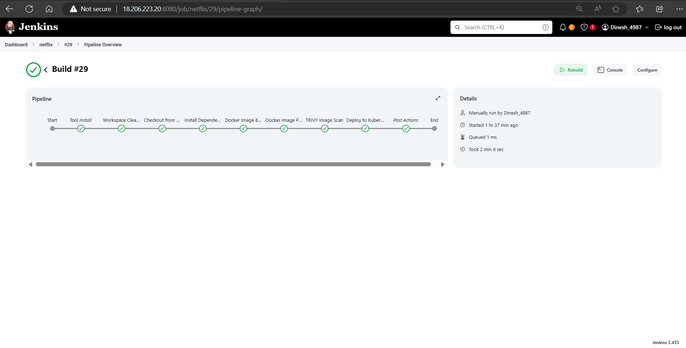

<!DOCTYPE html>
<html lang="en">
<head>
  <meta charset="UTF-8">
  <meta name="viewport" content="width=device-width, initial-scale=1.0">
</head>
<body>
  <h1>Netflix Clone on Kubernetes</h1>
  
This project deploys a Netflix clone application on Kubernetes, utilizing DevOps practices and security best practices.

  <section>
  
  </section>
  
  <h2>Technologies Used</h2>
  <ul>
    <li>Infrastructure: AWS</li>
    <li>Containerization: Docker</li>
    <li>Orchestration: Kubernetes</li>
    <li>CI/CD: Jenkins</li>
    <li>Monitoring: Prometheus, Grafana</li>
    <li>Security Scanning: Trivy, SonarQube</li>
    <li>Kubernetes Management: Kubectl</li>
    <li>API: TMDB</li>
  </ul>

  <h2>Project Setup</h2>
  <ol>
    <li><strong>Infrastructure Provisioning:</strong> The project sets up infrastructure on AWS, including servers for Jenkins, monitoring, and Kubernetes nodes.</li>
    <li><strong>CI/CD Pipeline:</strong> A Jenkins pipeline is configured to build Docker images and deploy the application.</li>
    <li><strong>Containerization:</strong> The application is containerized using Docker.</li>
    <li><strong>Deployment:</strong> The containerized application is deployed and managed on Kubernetes.</li>
    <li><strong>Monitoring:</strong> The application health is monitored using Prometheus and Grafana.</li>
    <li><strong>Security Scanning:</strong> The application and infrastructure are scanned for vulnerabilities using Trivy and SonarQube.</li>
  </ol>

  <h2>Getting Started</h2>
  <ol>
    <li>Clone this repository.</li>
    <li>Install the required dependencies (AWS CLI, Docker, Kubectl, etc.).</li>
    <li>Configure the AWS credentials and Kubernetes cluster access.</li>
    <li>Configure the Jenkins pipeline (refer to Jenkins documentation for details).</li>
    <li>Build and deploy the application using the Jenkins pipeline.</li>
  </ol>

  <h2>Deployment Outputs</h2>
  
This section showcases screenshots from various stages of the deployment process.

  <section>
    <h3>Jenkins Pipeline</h3>
    
  </section>

  <section>
    <h3>SonarQube Analysis</h3>
    
  </section>

  <section>
    <h3>Docker images build during the process </h3>
    
  </section>
  
  <section>
    <h3>Kubectl Outputs</h3>
    
  </section>
  
  <section>
    <h3>Prometheus Monitoring</h3>
    
  </section>

<section>
  <h3>Grafana Monitoring</h3>
  
  

</section>

<section>
  <h3>Bingoo!!!</h3>
  
</section>

  <h2>Additional Notes</h2>
  

    * This project demonstrates a basic deployment of a Netflix clone application on Kubernetes.
    * You can customize the project to fit your specific needs.
    * Refer to the documentation of the respective tools for detailed instructions.
  

</body>
</html>
